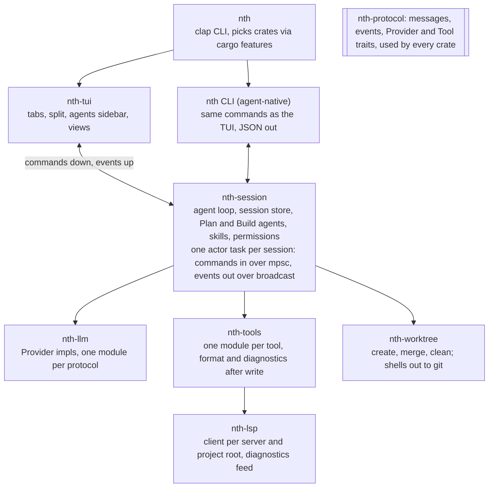
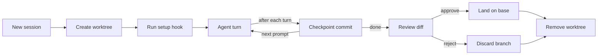
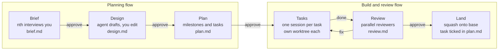
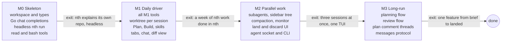

# nth — Design Doc

Sep 28, 2026 · Koen Klinkers · [live doc with comments](https://claude.ai/code/artifact/3d650e72-a61f-438d-8735-524c10665721)

## Summary and goals

nth ("N-th time") is a personal, opinionated coding harness in Rust. It runs many agents in parallel on one machine, each in its own git worktree, behind a tabbed TUI that always shows which agent is doing what. It copies opencode's defaults wherever there is no strong opinion. Its novelty budget goes to four things: worktree-native multi-agent work, the TUI, long-running plan and review flows, and plans you review with inline comments.

**Goals**

1. Daily-drivable for real work on nth itself within the first milestone, so it is dogfooded from week one.
2. Learn the internals of a harness: provider streaming, tool calling, context management, LSP.
3. Every subsystem sits behind a trait in its own crate, so a provider, tool set or view can be swapped without touching the core.
4. **Multi-agent by default.** Several agents work on one machine at once without stepping on each other: parallel sessions, subagents, and flows that coordinate them. The UI makes it obvious at a glance which agents exist, what each is doing, and which one is waiting for you.
5. **Plans are reviewed with comments.** You leave inline comment threads on a plan or design, the agent answers or revises each one, and approval means every thread is resolved. It works the way this doc is being reviewed.
6. **Clean git history.** Base only ever gets one well-described commit per task. Checkpoint commits and agent noise never reach it.
7. **Agent-native.** The same application serves humans and agents equally. Every action is one command that the TUI, the CLI and agent tools all issue, and every view has a text form an agent can read. Nothing is TUI-only.

**Non-goals**

- Configurability for other users. Opinions are hardcoded. `~/.config/nth/config.toml` only tunes defaults such as the provider, model, tool limits and extra skill folders, and secrets stay in environment variables.
- A client/server split, web UI, desktop app or IDE plugin. opencode has these; nth does not need them.

  The one exception is a local Unix socket on a running nth. It carries the same commands and events as JSON lines, so a CLI call or an agent acts on the sessions you see in the TUI.

- Plugin loading at runtime. Swapping happens at compile time through crates and cargo features.
- Multi-user or team features, telemetry, sharing sessions by link.

## Scope sparring

The list asks for three new ideas and a full opencode clone all at once, and that is where this kind of project usually stalls. Ship a boring, dogfoodable core first. Add each novel feature only once the core is in daily use.

**Pushback, point by point**

1. **Worktrees are for parallel agents, not sandboxing.** The goal is several agents working on one machine without stepping on each other. A worktree gives each agent its own checkout, branch and build state. It does not limit what a process can do, and nth does not try to. Security sandboxing is out of scope.
2. **Worktrees have a real cost in Rust.** Each worktree gets a cold `target/` dir, which means minutes of rebuilds and gigabytes of disk. Each one also needs its own rust-analyzer. Plan for sccache and a per-repo setup hook from day one, or the feature will feel slow.
3. **Merging back is the hard part, not creating the worktree.** The exact mechanics can wait until M2. The constraint is fixed now: base gets a clean history of one well-described commit per task, and checkpoint commits never reach it.
4. **A tiling TUI is a rabbit hole.** Decided: no tiling. The screen is three fixed bands: content, input and status (see [ui.md](ui.md)). That covers every planned view without a layout engine.
5. **Long-run plan and review flows should come last, not first.** Their shape will be obvious after a month of daily use and a guess before that. Build them as agents, prompts and a markdown artifact on the existing loop, never as a workflow engine.
6. **OpenCode Go speaks three wire protocols.** Its models sit behind chat completions (GLM, Kimi, DeepSeek), Anthropic messages (MiniMax and others) and OpenAI responses (Grok, GPT Luna). M1 implements only chat completions, which already covers the strongest open coding models.
7. **LSP means diagnostics only in M1.** opencode's main LSP payoff is feeding compiler errors back after an edit. Hover, go-to-definition and symbol tools can wait.
8. **MCP is not on the list, and it should stay off it.** Integrations are skills that call REST APIs or CLIs through bash. nth ships no MCP client.

**The cut**

| Feature                                          | M1 (daily driver)                            | Later                                                  |
| ------------------------------------------------ | -------------------------------------------- | ------------------------------------------------------ |
| Agent loop, streaming, tool calls                | yes                                          |                                                        |
| Tools: read, write, edit, glob, grep, bash, todo | yes                                          | webfetch, task, question                               |
| Plan and Act modes                               | yes                                          | custom agents                                          |
| Sessions                                         | persist and resume                           | compaction, fork, revert                               |
| Worktrees                                        | one per session, auto-created                | merge flow UI, pool, cleanup                           |
| Providers                                        | Go over chat completions                     | messages, responses, Anthropic direct                  |
| Skills                                           | markdown files and a skill tool              |                                                        |
| Formatting                                       | run formatter after each write               |                                                        |
| LSP                                              | diagnostics from every server on PATH        | symbol tools                                           |
| TUI                                              | content panel, input panel, status bar; chat | content tabs: diff, monitor, worktrees, plan           |
| Long-run flows                                   |                                              | plan/design flow, review flow                          |
| Multi-agent                                      | parallel sessions, one tab each              | subagents via the task tool, agents sidebar            |
| Agent-native control                             | one command set, CLI with JSON output        | socket to a running TUI, agent tools for every command |
| Plan review                                      | Plan agent writes a plan file                | inline comment threads on plans                        |

## Architecture

nth is a single binary built from a cargo workspace. The session loop runs as an actor, and the TUI is just one subscriber to its event stream. opencode splits into a server and clients over HTTP. nth keeps everything in one process but draws the same line with channels, so a headless mode and tests come for free.



Arrows point from caller to callee. Only the binary knows the concrete types. Every other crate depends on the traits in nth-protocol.

**One application for humans and agents**

Every action is a `Command` in nth-protocol: start a session, send a prompt, approve, comment on a plan, land, discard. Three front-ends issue exactly the same commands:

- **The TUI** maps keybindings to commands, for you.
- **The CLI** exposes each command as `nth <verb>`. It prints a readable table in a terminal, and JSON lines when piped or given `--json`.
- **Agent tools** wrap the same commands, so nth's own agents can start a session, comment on a plan or check another agent exactly as you would.

Every view also has a text form with the same data, such as `nth agents`, `nth diff` and `nth plan`. An agent reads what you see.

**Rules**

- No feature ships TUI-only. If you can do it, an agent can do it through the same command, and the other way round.
- Approval gates name who approves. The default is you, but a flow can name an agent, which is how fully automated runs work.
- Command and event types are the stable interface, so they are versioned and documented like a public API.

**Swapping things out**

- **A new provider** is a new module in nth-llm that implements `Provider`, behind a cargo feature.
- **A new tool** is a module in nth-tools that implements `Tool`. It is registered in one list the agent definitions filter on.
- **An experiment with the whole loop** is a second session crate with the same command and event types. The TUI does not notice.
- **A new view** is a type in nth-tui that implements `View`. It renders from the event stream and never calls the session directly.

**Layout inside a crate** follows your dev taste: one folder per feature, split only when it grows.

```
crates/
├── nth/                 # binary: CLI, wiring
├── nth-protocol/        # Message, Part, Event, Command, traits
├── nth-session/
│   └── src/
│       ├── actor.rs     # the loop: prompt → stream → tools → repeat
│       ├── agents/      # plan.md, build.md prompt templates + tool filters
│       ├── store.rs     # one JSON file per session
│       └── skills.rs
├── nth-llm/src/chat_completions/   # later: messages/, responses/
├── nth-tools/src/{read,write,edit,glob,grep,bash,todo}/
├── nth-format/          # formatters run after a write
├── nth-worktree/
├── nth-lsp/src/         # hand-written LSP client, server table, pool, report
│   ├── client/          # one task per server process
│   └── server/          # opencode's servers and their project roots
└── nth-tui/src/views/{chat,diff,worktrees,monitor}/
```

**Runtime rules**

- One tokio task per session owns all its state. Nothing is shared behind a mutex.
- A `CancellationToken` per turn stops the stream and any running tools when you press Esc.
- Events are a `broadcast` channel. A slow view that lags drops events and re-syncs from the store, so it never blocks the loop.
- Prompts live in template files, not inline strings.

## Core subsystems

Each subsystem copies opencode's behaviour unless the table says otherwise. The only real departures are storage, which is simpler, and permissions, which are looser inside a worktree.

| Subsystem    | nth decision                                                                                                                                                                                                                                                                                                                                                                                                                                                                                                                                                                   | opencode reference                          |
| ------------ | ------------------------------------------------------------------------------------------------------------------------------------------------------------------------------------------------------------------------------------------------------------------------------------------------------------------------------------------------------------------------------------------------------------------------------------------------------------------------------------------------------------------------------------------------------------------------------ | ------------------------------------------- |
| Sessions     | One JSON file per session under `$XDG_DATA_HOME/nth/sessions`, rewritten after every turn; empty sessions are not saved. Listed by last use, not by directory. Resume restores the session's cwd and rebuilds the chat from its messages.                                                                                                                                                                                                                                                                                                                                      | SQLite through drizzle, `session/`          |
| Agent loop   | Prompt, stream, run tool calls in parallel, append results, repeat until no tool calls. Esc cancels the turn.                                                                                                                                                                                                                                                                                                                                                                                                                                                                  | `session/processor.ts`, `session/prompt.ts` |
| Agents       | Build and Plan as primary agents. Explore and worker subagents through the task tool in M2, as described under Multi-agent.                                                                                                                                                                                                                                                                                                                                                                                                                                                    | `agent/agent.ts`                            |
| Tools        | read, write, edit, glob, grep, bash, todo in M1. Tool descriptions copied from opencode's `.txt` files.                                                                                                                                                                                                                                                                                                                                                                                                                                                                        | `tool/`                                     |
| Permissions  | Allow everything inside the session's worktree. Ask for paths outside it and for a small deny-list of bash commands.                                                                                                                                                                                                                                                                                                                                                                                                                                                           | `permission/`, per-agent rules              |
| Skills       | `SKILL.md` folders wherever Claude Code, opencode and the open standard keep them: `~/.claude/skills`, `~/.config/opencode/skills`, `~/.agents/skills` and `~/.config/nth/skills`, then `.claude`, `.opencode`, `.agents` and `.nth` skill folders from the repo root down to the cwd, then `[skills] paths` from the config. A later find wins a name clash. `nth skills` lists them. Names and descriptions go in the system prompt, and a `skill` tool loads the body.                                                                                                      | `skill/`, `tool/skill.ts`                   |
| Formatting   | The `nth-format` crate. After every write, edit or apply_patch, run each formatter for that file type whose program is already installed and that applies to the project: opencode's set (rustfmt, prettier, biome, ruff, gofmt, clang-format and more), plus custom ones from `[format]` in the config. Each runs with a 10 s timeout. The model gets a note only (`Formatted with rustfmt.`, or the first error line), not the formatted file. `nth formatters` lists them.                                                                                                  | `format/formatter.ts`                       |
| LSP          | The `nth-lsp` crate. opencode's server set (rust-analyzer, typescript-language-server, gopls, pyright, clangd and more), plus custom ones from `[lsp]` in the config, each used only when its program is on PATH. One client per (server, project root), started lazily. read touches the file without waiting, to warm the server. After a write, edit or apply_patch, wait briefly for diagnostics and append the errors: write's for this file and up to five others, edit's for the edited file only, apply_patch's for each file it changed. `nth lsp` lists the servers. | `lsp/`, diagnostics in edit tool            |
| Instructions | One global file, the first of `~/.config/nth/AGENTS.md`, `~/.config/opencode/AGENTS.md` and `~/.claude/CLAUDE.md`. Then every `AGENTS.md` from the repo root down to the cwd, or every `CLAUDE.md` when there is no `AGENTS.md`. Read afresh when a session is resumed. Deeper files are attached to a read result once, the first time read touches a file below them.                                                                                                                                                                                                        | `session/instruction.ts`                    |
| Compaction   | M2. Summarise older turns once the context window is 80% full.                                                                                                                                                                                                                                                                                                                                                                                                                                                                                                                 | `session/compaction.ts`                     |

**Plan and Act**

opencode calls these agents plan and build; nth calls them modes, plan and act.

- **Plan** is the default in the chat. It cannot edit code: write, edit and apply_patch may touch one file, `.nth/plans/<session>.md`, which is the same trick opencode uses. On the first plan turn the model gets opencode's plan-mode reminder.
- **Act** has every tool, and is what `nth run` uses unless given `--mode plan`. Switching from plan tells the model and points it at the plan file.
- **Plan review** uses comment threads, as described under Long-running flows. Act does not start until every thread on the plan is resolved.
- Tab switches between the two, as in opencode, and each has its own model and effort in the config.

**Provider for OpenCode Go**

- The M1 implementation is one `chat_completions` module that streams SSE and parses tool-call deltas. It works against any OpenAI-compatible endpoint, not only Go.
- Go asks clients to send a stable `x-opencode-session` header per conversation for routing and prompt caching. It also asks for a real user agent, such as `nth/0.1`. Both are cheap and both are required.
- Model metadata such as context size and pricing comes from models.dev, as in opencode, and is cached on disk.
- opencode keeps a system prompt per model family. nth ships all of opencode's family personas (`default`, `kimi`, `gpt`, `gpt-astra`, `beast`, `codex`, `gemini`, `anthropic`, `trinity`, `meta`), picked by model id, plus one environment block; more land only when a model misbehaves.

## Worktree-native execution

Every session gets its own worktree and branch, created before the first prompt. The agent never touches your main checkout. You land its work with one command or throw it away.



The checkpoint commit after each turn replaces opencode's separate snapshot system. Undoing a turn is `git reset` to the previous checkpoint, and the diff view is `git diff base...HEAD`.

**Rules**

- **Location.** Worktrees live in `~/.local/share/nth/worktrees/<repo>/<slug>`, outside the repo, so tools like cargo and ripgrep in your main checkout never see them.
- **Branch.** Each one is named `nth/<slug>` and forks from the current `HEAD`, as opencode does with `opencode/<slug>`.
- **Setup hook.** An optional `.nth/setup.sh` runs once after creation. It copies `.env` files, sets `RUSTC_WRAPPER=sccache`, and runs installs.
- **Checkpoints.** One commit per turn, with a message the model writes. Landing squashes them into one commit.
- **Landing.** Rebase the branch onto base, squash it, then fast-forward base. If the main checkout is dirty, landing stops and says so.
- **Cleanup.** Removing a worktree also deletes its branch unless it has unlanded commits. `nth gc` lists stale worktrees.
- **Several sessions** can run in parallel, one worktree each. This is the main payoff, and the TUI's worktree view exists to manage it.

**Parallelism, not security.** Worktrees exist so agents do not disturb each other or your checkout. Permissions only ask before touching paths outside the worktree. nth does not sandbox processes.

## Multi-agent

Every agent is its own actor with an id, a parent and a status, and every event carries that id. The UI, the CLI and the flows all read the same tree of agents, so "which agent is doing what" is never guesswork.

**Three ways agents multiply**

| Kind            | How it starts                              | Worktree                            | Example                        |
| --------------- | ------------------------------------------ | ----------------------------------- | ------------------------------ |
| Session         | You open a tab, or a flow starts a task    | its own                             | two features in parallel       |
| Subagent        | The task tool, called by a session's agent | the parent's; read-only while the parent plans | Explore searching the codebase |
| Worker subagent | The task tool with write access            | its own, branched from the parent's | a flow fanning out edits       |

**Coordination rules**

- A subagent runs in the background and reports back through a notice in the model's inbox, as a monitor does; headless, through its task tool result. It never writes into the parent's transcript.
- A worker subagent's branch lands on its parent's branch, never on base. Only the session lands on base, which keeps history clean.
- Every agent has one status: running, waiting for you, idle, done or failed. "Waiting for you" covers permission prompts, questions and plan approvals.
- A global limit on concurrent model requests stops ten agents from hitting provider rate limits at once.

**How the UI shows it**

- The agents sidebar lists every agent on the machine as a tree: session, then subagents. Each row shows a status marker and what the agent is doing right now, such as `edit src/client.rs`.
- Each subagent has a tab with its transcript, and the prompt talks to the subagent whose tab shows (see [ui.md](ui.md#subagents)). Esc there stops its turn; the tab keys go back to the chat.
- Tabs with an agent waiting for you are marked in yellow in the tab bar, and a desktop notification fires.
- The same tree comes out of `nth agents --json`, so an agent can check on other agents.

## TUI

The TUI is three bands stacked top to bottom: a content panel, an input panel and a status bar. There is no tiling engine. Views are independent widgets that render from the event stream, so a new view is a new struct, not a change to the app.

**Layout.** See [ui.md](ui.md) for the full design.

- **Content panel.** Chat by default. Later it holds tabs such as Diff, Worktrees, Monitor and Plan, which replace the earlier side pane and agents sidebar.
- **Input panel.** The 1-line prompt by default. Context swaps it for another input panel, such as the model picker, and each one declares its own height.
- **Status bar.** Fixed at 2 lines at the bottom, always visible: what is happening now, and general state such as mode, model and place.
- **Keys.** A leader key of `ctrl+x`, as in opencode. Tab switches plan and act.

Markers: ● running, ? waiting for you, ✓ done. The tab strip and status bar differ from the content by background colour only. There are no border or divider lines.

**Views**

| View           | Shows                                                                                                | Milestone         |
| -------------- | ---------------------------------------------------------------------------------------------------- | ----------------- |
| Agents sidebar | Every agent as a tree with status and current action. M1 lists sessions only; subagents appear in M2 | M1                |
| Chat           | Transcript, tool calls collapsed to one line each, and input                                         | M1                |
| Diff           | Worktree diff against base, file list plus hunks                                                     | M1                |
| Worktrees      | Every session's worktree, branch, ahead/behind count and status, with land and discard actions       | M2                |
| Monitor        | One tab per background command the model started with `monitor`: its live output and state        | done              |
| Plan           | The plan or design file with inline comment threads, plus the todo list                              | M2                |
| Events         | Raw event stream, for debugging nth itself                                                           | M1, behind a flag |

**Styleguide**

- Only the 16 ANSI colours, 8 standard plus 8 bright, and the terminal's default foreground and background. Your terminal theme drives the look.
- One exception: syntax-highlighted code (code blocks, file contents, edit diffs) is drawn in Dracula colours on Dracula's background, through [hoodrich](https://github.com/kloki/hoodrich). Sixteen colours are too few to tell keywords, strings, types and comments apart. The code background marks the block off, so the fixed palette never clashes with the theme. Markdown itself (headings, emphasis, lists, quotes, tables) stays within the 16.
- Hierarchy comes from modifiers, not more colours: bold for names, dim for secondary text, reversed for selection and the active tab.
- No borders or divider lines. Panes are separated by background colour and one column of padding.
- One line per tool call by default. Details expand in place on Enter.

| Role                                     | Style                    |
| ---------------------------------------- | ------------------------ |
| Body text                                | default fg on default bg |
| Secondary text                           | default fg, dim          |
| Sidebar, side pane, tab bar, status line | bright black background  |
| Selection, active tab                    | reversed                 |
| Act mode, accents                        | blue                     |
| Plan mode                                | magenta                  |
| Tool names, paths                        | cyan                     |
| Success, added lines                     | green                    |
| Errors, removed lines                    | red                      |
| Waiting for approval                     | yellow                   |

**Why 16 and not 8.** In many dark themes ANSI black is the same colour as the default background, so a black pane would be invisible. Bright black fixes that and is still a theme colour.

## Long-running flows

Both flows are markdown files on disk plus agents with fixed prompts. There is no workflow engine. Each step reads the previous step's file and writes its own, and you approve the file before the next step starts. A flow can stop for days and resume from the files alone.



At each approve gate you comment, the agent resolves threads, then you approve.

Each arrow is an agent run. At each diamond you comment on the file, the agent answers or revises every thread, and you approve once they are all resolved.

**Planning and design flow** (`nth project new <name>`)

1. **Brief.** A Plan-mode agent asks you questions one at a time until it can write `brief.md`: the goal, constraints and what done means.
2. **Design.** An agent reads the brief and the codebase, then drafts `design.md`. You edit it directly.
3. **Plan.** An agent turns the design into `plan.md`: milestones, and tasks small enough for one session each, with the dependencies between them.
4. **Tasks.** Each approved task can start its own session and worktree with the plan and design already in context. Independent tasks run in parallel.

Files live in `.nth/projects/<name>/` and are committed, so the plan travels with the repo.

**Commenting on plans**

This works like reviewing this doc. It applies to Plan-mode plans and to every file in the planning flow.

1. In the Plan view you select a line or range and press `c` to start a thread.
2. Threads are stored beside the file in `<file>.comments.jsonl`. Each one is anchored by the quoted text, so it survives edits to the rest of the file.
3. Sending the review gives the agent every open thread at once. For each thread it either replies, or edits the file and replies with what changed.
4. You resolve threads or answer back. Approve is disabled while any thread is open.
5. Resolved threads stay in the file's history, so a later agent can see why the plan looks the way it does.

**Review flow** (`nth review [branch]`)

1. **Fan out.** Reviewer subagents run in parallel, one per dimension: correctness, simplicity, tests, and your coding guidelines.
2. **Verify.** A second pass tries to disprove each finding and drops those it can refute. This keeps false positives down.
3. **Triage.** Findings land in `review.md` and in a TUI list. Per finding you choose fix, which queues a Build turn in the same worktree, or skip.
4. **Gate.** Landing a branch that belongs to a project task runs this flow first.

## Milestones, open questions and risks

Four milestones. Each one ends with a usage test rather than a feature list, and M1 is the one that matters: from then on nth is built with nth.



There are no dates on purpose. Each exit test is the gate for starting the next milestone.

**Open questions**

- [x] **How does work land?** The proposal is squash plus fast-forward onto base in the main checkout. The alternative is always pushing a branch and opening a PR. This decides the shape of the worktree view.
- [x] **Shared or separate `target/` dirs?** One shared `CARGO_TARGET_DIR` saves disk, but cargo's lock makes parallel sessions wait on each other. The proposal is separate dirs plus sccache.
- [x] **Is `bash` auto-allowed inside the worktree?** The proposal is yes, with a small deny-list.
- [x] **8 or 16 colours?** Decided: 16, so panes can use bright black.
- [x] **All crates on day one?** Your dev taste says start small and split when things grow. The proposal is that M0 creates protocol, session, llm, tools, tui and the binary. nth-worktree and nth-lsp are created when M1 needs them.
- [x] **JSONL or SQLite for sessions?** JSONL is enough until you want search across sessions. Revisit in M2.

**Risks**

- **Tool-call quality varies across open models.** Each provider streams tool-call deltas slightly differently. Record real SSE streams from Go and replay them in tests, as opencode's `http-recorder` package does.
- **The TUI eats the project.** Keep views dumb and the layout fixed, and time-box TUI polish in each milestone.
- **Chasing opencode.** It moves fast. Pin the reference clone and re-pin on purpose, never to keep up.
- **Worktree friction kills the habit.** If creating a session is slower than a few seconds, you will stop using nth. Measure it in M1.
