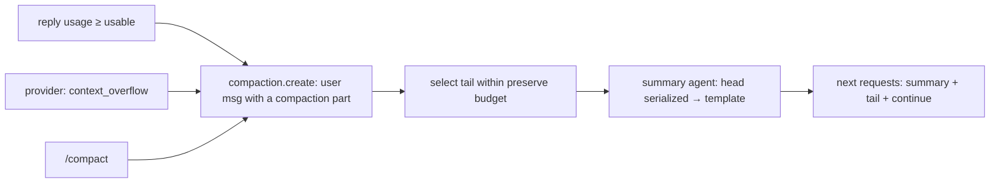

# Context management & token use

|                     |                                            |
| ------------------- | ------------------------------------------ |
| **opencode commit** | `03e67171ab2dc1e7f16e8cebfbc7f778f61b89f0` |
| **Researched**      | 2026-10-10                                 |
| **Sources**         | source · docs (TUI tips)                   |

## Summary

opencode keeps a session inside the model's window with four measures, in
the order they bite: every tool's output is capped (2000 lines / 50 KB, the
rest written to disk with a hint to grep it or delegate); old tool results
are **pruned** to `[Old tool result content cleared]` once a session has
40k tokens of them (opt-in); the session is **compacted** into a structured
summary plus a verbatim tail once the last reply's usage reaches the usable
window (automatic, or `/compact`); and a provider's context-overflow error
triggers the same compaction with the failed prompt replayed. Prompt caching
puts breakpoints on the system prompt and the last two messages. nth has the
first and the last; it has no pruning and no compaction, so a long session
re-sends every tool result ever produced on every step.

## User-facing behaviour

- `[source]` Any tool output over 2000 lines or 50 KB comes back as a
  preview plus `...N lines truncated...` and "Full output saved to:
  <path>", telling the model to grep the file, or to hand it to the
  explore agent when the agent may use `task`. Limits are
  `tool_output.max_lines` / `max_bytes` in the config.
- `[source]` `compaction.auto` (default true): when a reply's usage reaches
  the usable window, the next step is a compaction instead of the model's
  next step. `OPENCODE_DISABLE_AUTOCOMPACT` turns it off.
- `[source]` `compaction.prune` (default false, `OPENCODE_DISABLE_PRUNE`):
  after every turn, tool outputs older than the last two user turns and
  beyond the newest 40k tokens' worth are blanked in the saved history.
- `[source]` `compaction.tail_turns`, `preserve_recent_tokens`, `reserved`:
  how many recent turns stay verbatim after a compaction, the token budget
  for them (default a quarter of the usable window, 2k–15k), and the buffer
  below the window at which compaction fires (default `min(20k, max output)`).
- `[docs]` TUI: `<leader>c` or `/compact` runs one by hand; the tips view
  says "Run /compact to summarize long sessions near context limits". A
  subagent's footer shows tokens as a percentage of the window.
- `[source]` Compaction is an agent, `compaction`, so its model and prompt
  can be set like any agent's.

## Where it lives

```
packages/opencode/src/
├── tool/
│   ├── truncate.ts        # cap any tool's output; spill the rest to disk
│   ├── truncation-dir.ts  # $data/tool-output
│   ├── tool.ts            # the wrapper every tool runs through, applies it
│   └── read.ts            # read's own caps (2000 lines, 2000 chars/line, 50 KB)
├── session/
│   ├── overflow.ts        # usable window, isOverflow
│   ├── compaction.ts      # prune, tail selection, the compaction turn
│   ├── message-v2.ts      # history → model messages; cleared/truncated outputs
│   ├── processor.ts       # sets needsCompaction from usage or an overflow error
│   ├── prompt.ts          # the loop: compaction task, overflow check, prune after turn
│   └── instruction.ts     # nested AGENTS.md attached once; skipped once pruned
├── provider/transform.ts  # applyCaching: cache breakpoints
└── util/token.ts          # estimate = chars / 4
packages/core/src/session/compaction.ts   # the summary prompt and template
```

## How it works

### 1. Every tool's output is capped at the wrapper

1. **Wrap** — `Tool.define` runs the tool, then `truncate.output` on its text unless the tool already set `metadata.truncated` ([`tool/tool.ts:131`](https://github.com/anomalyco/opencode/blob/03e67171ab2dc1e7f16e8cebfbc7f778f61b89f0/packages/opencode/src/tool/tool.ts#L131)).
2. **Cap** — over `max_lines` (2000) or `max_bytes` (50 KB) the full text is written to `$data/tool-output/<id>` and the preview keeps the head (or tail on request) ([`tool/truncate.ts:85`](https://github.com/anomalyco/opencode/blob/03e67171ab2dc1e7f16e8cebfbc7f778f61b89f0/packages/opencode/src/tool/truncate.ts#L85)).
3. **Hint** — the note names the file and, when the agent may call `task`, says "Do NOT read the full file yourself - delegate to save context" ([`tool/truncate.ts:129`](https://github.com/anomalyco/opencode/blob/03e67171ab2dc1e7f16e8cebfbc7f778f61b89f0/packages/opencode/src/tool/truncate.ts#L129)).
4. **Clean** — files older than 7 days are removed hourly ([`tool/truncate.ts:53`](https://github.com/anomalyco/opencode/blob/03e67171ab2dc1e7f16e8cebfbc7f778f61b89f0/packages/opencode/src/tool/truncate.ts#L53)).
5. **Read** sets its own caps and `truncated` metadata, so the wrapper leaves it alone: 2000 lines by default, each line cut at 2000 chars, and a 50 KB stop whatever the limit ([`tool/read.ts:14`](https://github.com/anomalyco/opencode/blob/03e67171ab2dc1e7f16e8cebfbc7f778f61b89f0/packages/opencode/src/tool/read.ts#L14), [`:162`](https://github.com/anomalyco/opencode/blob/03e67171ab2dc1e7f16e8cebfbc7f778f61b89f0/packages/opencode/src/tool/read.ts#L162)).

### 2. Old tool results are pruned after each turn (opt-in)

1. **When** — forked after the loop ends, never awaited ([`session/prompt.ts:1338`](https://github.com/anomalyco/opencode/blob/03e67171ab2dc1e7f16e8cebfbc7f778f61b89f0/packages/opencode/src/session/prompt.ts#L1338)); returns at once unless `compaction.prune` ([`session/compaction.ts:275`](https://github.com/anomalyco/opencode/blob/03e67171ab2dc1e7f16e8cebfbc7f778f61b89f0/packages/opencode/src/session/compaction.ts#L275)).
2. **Walk back** — from the newest message, skipping until two user turns have passed, stopping at a summary message or an already-pruned part; completed tool parts (not `skill`) add their estimated tokens, and once the running total passes `PRUNE_PROTECT` (40k) the rest are candidates ([`session/compaction.ts:288`](https://github.com/anomalyco/opencode/blob/03e67171ab2dc1e7f16e8cebfbc7f778f61b89f0/packages/opencode/src/session/compaction.ts#L288)).
3. **Blank** — only when the candidates total more than `PRUNE_MINIMUM` (20k) is each marked `state.time.compacted` and saved ([`session/compaction.ts:308`](https://github.com/anomalyco/opencode/blob/03e67171ab2dc1e7f16e8cebfbc7f778f61b89f0/packages/opencode/src/session/compaction.ts#L308)).
4. **Replay** — when history becomes model messages, a compacted part's output is `[Old tool result content cleared]` and its attachments are dropped ([`session/message-v2.ts:297`](https://github.com/anomalyco/opencode/blob/03e67171ab2dc1e7f16e8cebfbc7f778f61b89f0/packages/opencode/src/session/message-v2.ts#L297)). The TUI still shows the original; only the wire changes.
5. **Side effect** — nested instruction files that a pruned `read` attached count as no longer loaded, so the next read of that tree attaches them again ([`session/instruction.ts:22`](https://github.com/anomalyco/opencode/blob/03e67171ab2dc1e7f16e8cebfbc7f778f61b89f0/packages/opencode/src/session/instruction.ts#L22)).

### 3. The session is compacted when usage reaches the window



1. **Usable window** — `limit.input - reserved` when the model has an input limit, else `context - max_output`; `reserved` defaults to `min(20k, max output tokens)` ([`session/overflow.ts:10`](https://github.com/anomalyco/opencode/blob/03e67171ab2dc1e7f16e8cebfbc7f778f61b89f0/packages/opencode/src/session/overflow.ts#L10)).
2. **Overflow** — `input + output + cache read + cache write` of the last finished reply ≥ usable ([`session/overflow.ts:22`](https://github.com/anomalyco/opencode/blob/03e67171ab2dc1e7f16e8cebfbc7f778f61b89f0/packages/opencode/src/session/overflow.ts#L22)). Checked on the stream's finish event ([`session/processor.ts:491`](https://github.com/anomalyco/opencode/blob/03e67171ab2dc1e7f16e8cebfbc7f778f61b89f0/packages/opencode/src/session/processor.ts#L491)) and at the top of each loop step ([`session/prompt.ts:1161`](https://github.com/anomalyco/opencode/blob/03e67171ab2dc1e7f16e8cebfbc7f778f61b89f0/packages/opencode/src/session/prompt.ts#L1161)).
3. **Trigger** — a user message holding a `compaction` part is appended; the loop sees it as a task and runs `compaction.process` instead of a model step ([`session/compaction.ts:559`](https://github.com/anomalyco/opencode/blob/03e67171ab2dc1e7f16e8cebfbc7f778f61b89f0/packages/opencode/src/session/compaction.ts#L559), [`session/prompt.ts:1149`](https://github.com/anomalyco/opencode/blob/03e67171ab2dc1e7f16e8cebfbc7f778f61b89f0/packages/opencode/src/session/prompt.ts#L1149)). A provider's `context_overflow` error does the same with `overflow: true` ([`session/processor.ts:621`](https://github.com/anomalyco/opencode/blob/03e67171ab2dc1e7f16e8cebfbc7f778f61b89f0/packages/opencode/src/session/processor.ts#L621), [`session/prompt.ts:1321`](https://github.com/anomalyco/opencode/blob/03e67171ab2dc1e7f16e8cebfbc7f778f61b89f0/packages/opencode/src/session/prompt.ts#L1321)).
4. **Select the tail** — turns are walked from the newest, kept whole while they fit the preserve budget (a quarter of usable, 2k–15k, or `preserve_recent_tokens`); the first that does not fit is split at the first message from which the rest fits ([`session/compaction.ts:223`](https://github.com/anomalyco/opencode/blob/03e67171ab2dc1e7f16e8cebfbc7f778f61b89f0/packages/opencode/src/session/compaction.ts#L223), [`:140`](https://github.com/anomalyco/opencode/blob/03e67171ab2dc1e7f16e8cebfbc7f778f61b89f0/packages/opencode/src/session/compaction.ts#L140)). Size is `JSON.stringify(model messages).length / 4` ([`session/compaction.ts:215`](https://github.com/anomalyco/opencode/blob/03e67171ab2dc1e7f16e8cebfbc7f778f61b89f0/packages/opencode/src/session/compaction.ts#L215), [`core/src/util/token.ts:3`](https://github.com/anomalyco/opencode/blob/03e67171ab2dc1e7f16e8cebfbc7f778f61b89f0/packages/core/src/util/token.ts#L3)).
5. **Serialize the head** — earlier compaction pairs are hidden and the last summary passed as `previousSummary`; the head becomes `[User]:` / `[Assistant]:` / `[Assistant tool call]:` / `[Tool result]:` lines, each tool result cut to 2000 chars ([`session/compaction.ts:51`](https://github.com/anomalyco/opencode/blob/03e67171ab2dc1e7f16e8cebfbc7f778f61b89f0/packages/opencode/src/session/compaction.ts#L51), [`:363`](https://github.com/anomalyco/opencode/blob/03e67171ab2dc1e7f16e8cebfbc7f778f61b89f0/packages/opencode/src/session/compaction.ts#L363)).
6. **Summarize** — the `compaction` agent is run with no tools and no system prompt, on one user message: the template prompt plus the conversation ([`session/compaction.ts:425`](https://github.com/anomalyco/opencode/blob/03e67171ab2dc1e7f16e8cebfbc7f778f61b89f0/packages/opencode/src/session/compaction.ts#L425)). The template is fixed Markdown: Objective, Important Details, Work State (Completed / Active / Blocked), Next Move, Relevant Files ([`core/src/session/compaction.ts:16`](https://github.com/anomalyco/opencode/blob/03e67171ab2dc1e7f16e8cebfbc7f778f61b89f0/packages/core/src/session/compaction.ts#L16)). The reply is an assistant message with `summary: true`.
7. **Overflow replay** — on a provider overflow, the last real user message is cut from the head and re-appended after the summary so the failed prompt runs again ([`session/compaction.ts:340`](https://github.com/anomalyco/opencode/blob/03e67171ab2dc1e7f16e8cebfbc7f778f61b89f0/packages/opencode/src/session/compaction.ts#L340), [`:469`](https://github.com/anomalyco/opencode/blob/03e67171ab2dc1e7f16e8cebfbc7f778f61b89f0/packages/opencode/src/session/compaction.ts#L469)). Otherwise an automatic compaction appends a synthetic "Continue if you have next steps, or stop and ask" user message ([`session/compaction.ts:519`](https://github.com/anomalyco/opencode/blob/03e67171ab2dc1e7f16e8cebfbc7f778f61b89f0/packages/opencode/src/session/compaction.ts#L519)).
8. **Replay on the wire** — model messages start at the last summary; the compaction part reads as the user asking "What did we do so far?" and the tail is spliced in after the summary ([`session/message-v2.ts:232`](https://github.com/anomalyco/opencode/blob/03e67171ab2dc1e7f16e8cebfbc7f778f61b89f0/packages/opencode/src/session/message-v2.ts#L232), [`:549`](https://github.com/anomalyco/opencode/blob/03e67171ab2dc1e7f16e8cebfbc7f778f61b89f0/packages/opencode/src/session/message-v2.ts#L549)).
9. **Too big to compact** — if the summary request itself overflows, the session stops with `ContextOverflowError` ([`session/compaction.ts:450`](https://github.com/anomalyco/opencode/blob/03e67171ab2dc1e7f16e8cebfbc7f778f61b89f0/packages/opencode/src/session/compaction.ts#L450)).

### 4. Prompt caching

- `applyCaching` marks the first two system messages and the last two non-system messages with the provider's ephemeral cache option ([`provider/transform.ts:358`](https://github.com/anomalyco/opencode/blob/03e67171ab2dc1e7f16e8cebfbc7f778f61b89f0/packages/opencode/src/provider/transform.ts#L358)); it runs for Anthropic-family models unless the SDK does automatic caching ([`provider/transform.ts:468`](https://github.com/anomalyco/opencode/blob/03e67171ab2dc1e7f16e8cebfbc7f778f61b89f0/packages/opencode/src/provider/transform.ts#L468)).
- Reasoning is replayed with its signature so Anthropic's cache prefix stays intact ([`session/message-v2.ts:266`](https://github.com/anomalyco/opencode/blob/03e67171ab2dc1e7f16e8cebfbc7f778f61b89f0/packages/opencode/src/session/message-v2.ts#L266)).

## Key data types / interfaces

```ts
// core/src/v1/config/config.ts:149
compaction: {
  auto?: boolean                  // default true
  prune?: boolean                 // default false
  tail_turns?: number             // recent user turns kept verbatim
  preserve_recent_tokens?: number // budget for them
  reserved?: number               // buffer below the window
}
tool_output: { max_lines?: number; max_bytes?: number }   // 2000, 51200
```

```ts
// session/compaction.ts:28
export const PRUNE_MINIMUM = 20_000   // prune only if this much would go
export const PRUNE_PROTECT = 40_000   // newest tool output always kept
const TOOL_OUTPUT_MAX_CHARS = 2_000   // per result, in the summary prompt
const MIN_PRESERVE_RECENT_TOKENS = 2_000
const MAX_PRESERVE_RECENT_TOKENS = 15_000
```

A pruned result is the tool part with `state.time.compacted` set; a compaction is a user message with a `{ type: "compaction", auto, overflow, tail_start_id }` part followed by an assistant message with `summary: true`.

## Design decisions & trade-offs

- **Observed:** usage, not an estimate, decides overflow: the provider's own `input + output + cache` count from the last reply. The chars/4 estimate is used only to size the verbatim tail. — Cheap and exact where it matters.
- **Observed:** the history on disk is never rewritten by pruning or compaction; both are markers (`compacted` timestamps, a compaction part) that the wire conversion honours. — The TUI keeps the full transcript and `/undo` keeps working.
- **Observed:** truncated output goes to disk, and the hint steers the model to grep it or delegate to the explore agent rather than re-read. — The big output is one grep away without ever entering the main context.
- **Observed:** pruning is off by default. — **Inferred:** clearing results the model may still refer to costs re-reads, and 40k protected plus a 20k minimum make it fire only in long sessions.
- **Observed:** the compaction summary is a fixed template with sections that must stay even when empty, carried forward across compactions. — **Inferred:** a shape the model can be told to merge, so repeated compactions do not drift.
- **Observed:** `skill` output is never pruned. — Skills are instructions, not data; losing them changes behaviour.
- **Observed:** compaction keeps a verbatim tail by turn, splitting one turn when needed. — The model keeps the exact last exchange while the summary covers the rest.

## Takeaways for nth

Where nth stands at `8c93f35`:

| Measure                    | opencode                                          | nth                                                                           |
| -------------------------- | ------------------------------------------------- | ----------------------------------------------------------------------------- |
| Per-tool output cap        | every tool, 2000 lines / 50 KB, rest to disk      | bash and webfetch 30k chars (`nth-tools/src/output.rs`), read 50 KB, grep 100 matches; the rest is lost, not saved |
| Prune old tool results     | opt-in, after every turn                          | none: every result is re-sent on every step                                   |
| Compaction                 | automatic at the usable window, `/compact`, agent | none (`docs/design.md` lists it under M2)                                     |
| Overflow error recovery    | compact and replay the prompt                     | the turn fails                                                                |
| Cache breakpoints          | system ×2, last two messages                      | system and the last block (`nth-llm/src/messages/wire.rs:51`); `prompt_cache_key` on responses |
| Reasoning replay           | with signature                                    | dropped on messages (no signature kept), sent on chat completions             |
| Context shown              | % of window in a subagent's footer                | context bar in the status bar                                                 |

So the extra tokens come from the two missing rows: nothing ever leaves the history, and nothing caps a session. Each step of a turn re-sends every read, grep and bash result since the session began.

- **Copy: pruning first.** It is the smaller change and pays on every long session. On `Message::ToolResult` add a `compacted: bool` (or wrap `content` in an enum); `Session` runs a `prune` after each turn that walks back over `messages`, skips the last two user turns, sums `content.len() / 4` per result, and marks everything past 40k tokens once more than 20k would go. Each wire's `turns()` sends `[Old tool result content cleared]` for a marked result. Never touch the `skill` tool's results. The TUI keeps showing the original.
- **Copy: compaction as a turn.** A `Message::Compaction { summary, .. }` variant in the history; the wires start at the last one and send it as the "What did we do so far?" exchange. Trigger it in `run_turn` when the last `Usage` reaches `context_window - min(20k, max_output)`, both from the stream's usage and from a provider overflow error, and from `/compact`. The summary request is one user message (template plus serialized head, tool results cut to 2000 chars) on a `compaction` agent with no tools. Keep a verbatim tail by turns within a quarter of the window, 2k–15k.
- **Copy: the overflow replay.** On a provider's context-overflow error, compact with the last user prompt moved after the summary so it runs again. nth's loop already keeps `messages` valid on every exit, which is what this needs.
- **Copy: spill truncated output to disk.** `output::tail`/`head` should write the full text under `$XDG_DATA_HOME/nth/tool-output/<id>` and name it in the note, with the "grep it, or hand it to the explore agent" hint. Apply it in `run_call` to every tool's result rather than per tool, as opencode's wrapper does, and keep read's own caps. Clean up files older than a week.
- **Do differently: usage over estimate.** nth already receives `Usage` per step; drive overflow from it and keep the chars/4 estimate for sizing the tail only, as opencode does. Store the last usage on `Session` so the check survives a `/resume`.
- **Do differently: keep the signature.** The messages wire drops reasoning because nth does not keep the signature. Keeping it (an opaque string on `AssistantMessage`) and replaying thinking blocks would let Anthropic's cache prefix hold across steps; today every step after a thinking reply re-sends a prefix the cache has not seen. Worth measuring before compaction, since it may be a large share of the cost on Claude.
- **Avoid:** rewriting the saved history. Mark, do not delete, so the TUI's transcript and a future `/undo` keep the original.

## Open questions

- Does nth's dropped reasoning actually break the cache prefix on Anthropic, or does the API ignore missing thinking blocks for caching? Measure `cache_read_input_tokens` across steps in a thinking session.
- opencode's prune counts `user` messages to skip two turns, but a tool-result message is also role `user` on the wire; in opencode's own model it is a part of the assistant message, so the count is of real prompts. nth's `Message::ToolResult` is its own variant, so the walk must count `Message::User` only.
- How does the TUI show a compaction in the transcript (`session-ui`)? Not studied; a follow-up for the TUI note.
- `SessionReminders.apply` (`session/reminders.ts`) adds text to the prompt each step; whether it adds much is a question for the agent-loop note.
